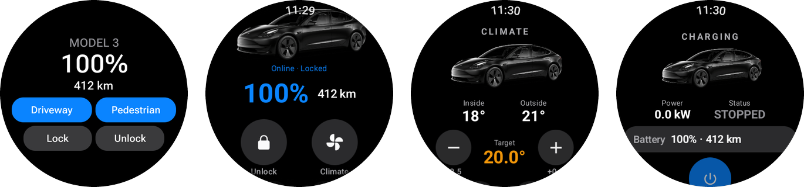
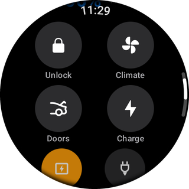
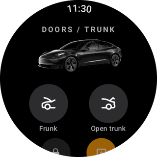
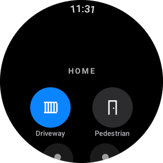

# HA Watch for Tesla (Wear OS)

**Control your Tesla from a Wear OS watch, through Home Assistant.**

Tesla ships a watch app only for the Apple Watch. This app gives Galaxy Watch and other Wear OS
watches a set of wrist controls for your Tesla. The watch never talks to Tesla directly: it
calls your Home Assistant, which already controls the car.

It is a **remote control through Home Assistant, not a phone key**: it needs a data connection
(Wi-Fi or the phone's connection) and a working Home Assistant and Tesla integration.



<p>
  
  
  
</p>

*Screenshots from a Galaxy Watch8 with real data (gate names are examples).*

## Features

- **Main screen**: car status (online, asleep, charging) and lock state, battery % and range,
  lock/unlock, climate, doors and trunk, charging, charge port, cable release, horn,
  flash lights, Sentry Mode, wake up.
- **Climate**: on/off, target temperature (limits and step read from your climate entity),
  window vent, presets (Normal, Defrost, Keep, Dog, Camp).
- **Doors / trunk**: frunk, trunk open/close, charge port, window state.
- **Charging**: start/stop, live power, charge limit and charging amps. The +/- buttons send
  one single command 1 s after your last tap, and the value is sent even if you leave the screen.
- **Tile**: battery and range at a glance, fixed **Lock** and **Unlock** buttons, plus up to two
  optional one-tap buttons (for example driveway and pedestrian gate).
- **Complication**: battery % on any watch face (short text or ring).
- **Optional home screen**: two gate buttons and two lights. Not configured means not shown.
- **Feedback**: a message and a vibration (unless the watch is in silent or power saving mode)
  when a lock/unlock is confirmed by the car, or when a command fails or cannot be confirmed.
- **Works with the wrist down**: while a command and its check are running, a quiet
  "Sending to the car…" notification keeps the app connected. Wear OS cuts the network of
  background apps a few seconds after you leave them, which would lose the answer of a command
  to a sleeping car.
- English and Italian.

One refresh is a single `POST /api/template` (about 3 KB up, 1 KB down) for all the entities, or,
with `ha.read_mode=states`, small `GET /api/states/<entity>` calls. Cold start is under a second
on a Galaxy Watch8 and the release APK is under 4 MB.

## How it works

```text
Watch ──HTTPS──> Home Assistant REST API ──> Tesla integration ──> car
        (token stored encrypted on the watch)
```

- **Refresh**: every 15 s while the app is open, when the tile is shown (if the data is older
  than 30 s) and for the complication (every 5 min). Refreshes only read Home Assistant: they
  cost no Tesla API calls. The last state is cached for the tile.
- **Commands** are plain Home Assistant service calls (`lock.unlock`, `climate.set_temperature`,
  `number.set_value`...). They use your integration's Tesla API quota like any other HA action,
  and so does **Wake up** (a wake plus one data update). After each command the app reads the
  state again at 1.5, 5 and 12 s; for lock and unlock it checks, with reads made after the
  command, that the car really changed state, and tells you if it did not. Commands are never
  sent twice by the app or its HTTP library.
- **No placeholder data**: after a restart with the car asleep, the Tesla Custom Integration fills
  its entities with placeholders (doors unknown, trunk "open"). The app then shows *No data*,
  offers only **Lock**, and refuses trunk, frunk, charge port and window commands until real
  data arrives (tap **Wake up**), because with placeholders a "close" can turn into an "open".

## Requirements

- A Wear OS 3+ watch (API 30+). Developed on a Galaxy Watch8 (Wear OS 6).
- Home Assistant reachable over **HTTPS** from where you use the watch
  (Nabu Casa, DuckDNS + NGINX, your own domain...).
- The [Tesla Custom Integration](https://github.com/alandtse/tesla) (HACS). Entity names default
  to its naming. Other Tesla integrations work only partly: each entity can be overridden, but
  an override must keep the same domain (`entity.charging` may also be a sensor), the climate
  presets are the Tesla Custom ones, and some entities (asleep, force data update) may not exist.
- To build: Android Studio (Ladybug or newer), or **JDK 17 or 21** + the Android SDK
  (Gradle 8.9 does not run on JDK 23 or newer).
- `adb`, to install the app and send the token (apps outside the Play Store are sideloaded).

## Setup

### 1. Configure

```bash
git clone https://github.com/MicheleMercuri/WearOS-HA-Watch-for-Tesla.git
cd WearOS-HA-Watch-for-Tesla
cp local.properties.example local.properties
```

Edit `local.properties`: at least `ha.url`, `ha.token` and `tesla.prefix`. Every key is
documented in [local.properties.example](local.properties.example). The file is in
`.gitignore`; never commit it. Unknown keys and malformed values stop the build with a message.

### 2. Build

```bash
./gradlew assembleRelease          # Windows PowerShell: .\gradlew.bat assembleRelease
```

The APK is in `app/build/outputs/apk/release/`. It is signed with your local debug key, which is
fine for a personal sideloaded app.

### 3. Install on the watch

1. Unlock the developer options. Galaxy Watch: **Settings > About watch > Software information**,
   tap *Software version* until developer mode is on. Other Wear OS watches:
   **Settings > System > About > Versions**, tap *Build number*.
2. **Developer options**: enable *ADB debugging* and *Wireless debugging*.
3. First time only, pair: *Wireless debugging > Pair new device*, then on the PC
   `adb pair <ip>:<pairing port>` and type the 6-digit code.
4. Connect and install:

```bash
adb connect <watch ip>:<port shown under Wireless debugging>
adb install -r app/build/outputs/apk/release/app-release.apk
```

### 4. Send the token

```bash
./gradlew provisionToken           # Windows PowerShell: .\gradlew.bat provisionToken
```

This reads `ha.token` from `local.properties` and sends it to the watch through adb's standard
input, to a small provider that accepts it only from the adb shell. The token is in no command
line on the PC and in no system log; on the watch it exists only for a moment in the
command line of the `content` tool, visible only to the adb shell. The task first checks that
this app is installed on the connected device. The app stores it in its private storage, encrypted with a key kept in
the Android Keystore. It is **not** inside the APK. Run it again after creating a new token;
`./gradlew clearToken` erases it. Use USB or *Wireless debugging* (encrypted), not the old
`adb tcpip`. With more than one adb device connected, set `ANDROID_SERIAL` first; the task uses
the `adb` of the `ADB` variable, then the one on your PATH, then the Android SDK's.

### 5. Tile and complication

- **Tile**: swipe from the watch face to the tiles, tap **+** and add **Tesla**.
- **Complication**: long press the watch face > Customize > pick a complication slot >
  **Tesla battery**.

## Token: admin or not

- `POST /api/template` (the fast, single-call refresh) is allowed only to **administrators**.
- With a **non-admin** token set `ha.read_mode=states`: the app then reads each entity with
  `GET /api/states/<entity>`, which any user may do. With the default `auto` the app finds out by
  itself, but that first attempt counts as one failed login in Home Assistant (two if the token is
  revoked); the result is remembered for that token. Settings shows which mode is in use.
- A non-admin user can still call every service (unlock the car, open the gates). What it cannot
  do is change Home Assistant itself: configuration, add-ons, the Supervisor. So a non-admin
  token limits the damage of a leak, it does not remove it.
- **Refused token**: Home Assistant counts every 401 as a failed login ("Login attempt failed"
  notification) and, if you set `login_attempts_threshold`, bans the IP after a few of them. So
  after a 401 or 403 the app stops refreshing and sending commands with that token, also after a
  restart, until you send a new token or tap **Test** in Settings.

## Configuration

All settings live in `local.properties`. Everything except `ha.token` is compiled into the app.

| Key | Required | Description |
|---|---|---|
| `ha.url` | yes | Home Assistant base URL, `https://host[:port]` |
| `ha.token` | yes | Long-lived access token, sent with `./gradlew provisionToken` |
| `ha.lan_ip` | no | Local shortcut on Wi-Fi, see below |
| `ha.allow_http` | no | `true` to allow a plain http `ha.url` (see Security) |
| `ha.read_mode` | no | `auto` (default) or `states` for a non-admin token |
| `car.name` | no | Name shown in the app and tile (default `Tesla`) |
| `tesla.prefix` | no | Entity prefix of the Tesla Custom Integration (default `model3`) |
| `entity.<key>` | no | Override one Tesla entity, or `none` for an optional one, see below |
| `home.gate_1`, `home.gate_2` | no | One-tap buttons in the app and on the tile |
| `home.light_1`, `home.light_2` | no | On/off buttons in the app |
| `home.<button>.name` | no | Label of that button |

### Tesla entities

`<p>` is `tesla.prefix`. Each line can be replaced with `entity.<key>=<entity_id>`.

| Key | Default entity | Used for |
|---|---|---|
| `battery` | `sensor.<p>_battery` | battery % |
| `range` | `sensor.<p>_range` | range (unit from the sensor) |
| `temp_inside` / `temp_outside` | `sensor.<p>_temperature_inside` / `_outside` | temperatures |
| `charger_power` | `sensor.<p>_charger_power` | charging power (kW) |
| `doors` | `lock.<p>_doors` | `lock.lock` / `lock.unlock` |
| `charge_port_latch` | `lock.<p>_charge_port_latch` | release the charging cable |
| `frunk` / `trunk` | `cover.<p>_frunk` / `cover.<p>_trunk` | `cover.open_cover` / `close_cover` |
| `windows` | `cover.<p>_windows` | vent / close windows |
| `charger_door` | `cover.<p>_charger_door` | open / close the charge port |
| `climate` | `climate.<p>_hvac_climate_system` | HVAC mode `heat_cool`/`off`, temperature, presets |
| `online` / `asleep` / `charging` | `binary_sensor.<p>_online` / `_asleep` / `_charging` | status |
| `sentry` | `switch.<p>_sentry_mode` | Sentry Mode |
| `charger` | `switch.<p>_charger` | start / stop charging |
| `charge_limit` / `charging_amps` | `number.<p>_charge_limit` / `_charging_amps` | `number.set_value` (limits from the entity; amps never below 5 A) |
| `horn` / `flash_lights` / `wake_up` / `force_update` | `button.<p>_horn` / `_flash_lights` / `_wake_up` / `_force_data_update` | `button.press` |

If an entity does not exist, the app shows how many are missing and one example, instead of
silently showing dashes. Entities your integration does not have can be switched off with
`entity.<key>=none` (their buttons disappear): `asleep`, `force_update`, `charger_power`,
`temp_inside`, `temp_outside`, `sentry`, `horn`, `flash_lights`, `windows`, `charge_port_latch`,
`charger_door`, `frunk`.

### Gates and lights

A gate button runs a momentary action chosen from the entity domain: `button` / `input_button`
are pressed, `script` / `switch` are turned on, `cover` is opened, `lock` is unlocked. If a gate is
driven by a relay (`switch`), give the relay an auto-off (for example Shelly *auto off* after
1 s) or wrap it in a script, otherwise it stays on. While a call for a gate is running, and for
10 s after it ended, further taps on that gate are refused (not queued), because a second pulse
stops or reverses many gate controllers. A gate that Home Assistant reports as unavailable is not
triggered.

Lights accept `switch`, `light`, `input_boolean` and `fan`. The button sends *turn on* or
*turn off* according to the state shown, so a stale screen repeats a command instead of undoing it.

### Local shortcut (`ha.lan_ip`)

At home the public URL often makes a detour through the router (hairpin NAT). With `ha.lan_ip`
set, when the watch is on Wi-Fi the app connects straight to that IP **but still speaks HTTPS to
the `ha.url` host name and verifies its certificate**. It works if the same certificate is served
on that IP and on the port of `ha.url`, which is the usual setup with the NGINX or Caddy add-on.
On any other network, a device that happens to have that IP cannot present your certificate, the
connection stops before the token is sent and the app uses `ha.url`. Leave it empty with
Nabu Casa.

## Security

Read this before you build: the watch can unlock your car and, if you configure them, open
your gates.

- **The token is not in the APK.** It is sent once over adb and stored encrypted (Android
  Keystore) in the app's private storage, with backups disabled (a device-to-device transfer could
  copy the encrypted value, useless without the watch's Keystore key). The provider that accepts it
  checks that the caller is the adb shell (or root), so no ordinary app on the watch can replace
  or erase it. If the watch is lost, revoke the token in Home Assistant.
- **HTTPS only by default.** Plain http is refused at build time unless you set
  `ha.allow_http=true`. With http the watch sends your token **unencrypted and automatically** to
  whatever device answers that name or IP on the network it is on; the app does it only on Wi-Fi,
  but on a hotel Wi-Fi that can still be a stranger. Prefer HTTPS (NGINX/Caddy add-on or
  Nabu Casa).
- **The local shortcut verifies the certificate** of your public host name (see above).
- **No exported buttons.** Tile buttons come back to the app through the tile binding, which
  only the system can use; the app has no exported activity or receiver that sends commands.
  Every drawn tile uses new button ids and each id runs at most once, so a tile refresh can never
  repeat a command.
- **Lock and Unlock never swap places** on the tile, and in the app two-state buttons ignore
  taps for 1.2 s after their state changes, so a refresh under your finger cannot turn a lock
  into an unlock.
- **No automatic retries of commands.** If a command was sent but no answer came back (or a proxy
  answered with a 5xx error), the app says so ("sent, no answer"), checks the car state, and
  refuses further commands on that entity until the car confirms or 90 s have passed, instead of
  sending it again.
- **One tap, no confirmation.** Unlock and the gate buttons act immediately, as in the
  official apps. The watch lock (PIN or pattern with wrist detection) is what protects them:
  keep it on.
- No analytics, no third-party services.

## Troubleshooting

| Symptom | Fix |
|---|---|
| Banner "Token missing" | Run `./gradlew provisionToken` |
| Banner "Token rejected (401)" | Wrong or revoked token: fix `ha.token`, run `./gradlew provisionToken`. Automatic refreshes stay off until then |
| Banner "Refused (403)" | Home Assistant banned the IP after failed logins: remove it from `ip_bans.yaml`, restart HA, then tap **Test** |
| Tile says "Data not current" | The last refresh failed: open the app to see why |
| Banner "N entities not found" | Wrong `tesla.prefix`, `entity.*` or `home.*` entity; for an entity your integration does not have, set `entity.<key>=none` |
| "No data" and dashes | The integration has no data yet (car asleep after a restart): tap **Wake up** |
| Banner `Unable to resolve host` / timeout | The watch cannot reach `ha.url` from its network |
| Settings shows route "remote" at home | `ha.lan_ip` not set, or the certificate is not served on that IP |
| Build error `local.properties: ...` | The message says which key is wrong |
| `provisionToken`: "more than one device" | Set `ANDROID_SERIAL=<ip:port>` and run it again |
| `provisionToken`: "server version doesn't match" | Two different adb installs: set `ADB` to the one you connected with |

Command outcomes appear for a minute in a blue (done) or orange (failed) banner; connection
errors appear in an orange banner. The **Settings** screen shows the configured URL,
the local IP, the end of the token, the read mode (template or per entity), the route of the last
call (home network or remote) and has a **Test** button.

## Project layout

```text
app/src/main/java/com/michele/teslawatch/
├── MainActivity.kt           navigation, 15 s refresh while visible
├── config/                   encrypted token storage and the adb-only token provider
├── data/
│   ├── HAClient.kt           REST client, local shortcut with certificate check
│   ├── TeslaRepository.kt    state, cache, commands, confirmation
│   ├── TeslaEntities.kt      entity IDs (from local.properties)
│   └── HomeConfig.kt         optional gates and lights
├── ui/                       Compose for Wear OS screens
├── tile/                     tile and its one-shot click handling
└── complication/             battery complication
```

## Contributing

Issues and pull requests are welcome. Before your first commit run
`git config core.hooksPath .githooks`: the pre-commit hook refuses any change that contains a
token or a value from your `local.properties`.

## Credits and license

Code: [MIT](LICENSE). The Tesla images (launcher icon, icons, car render) are © Tesla, Inc. and
are not covered by the MIT license; see [NOTICE.md](NOTICE.md). Not affiliated with Tesla, Inc.
